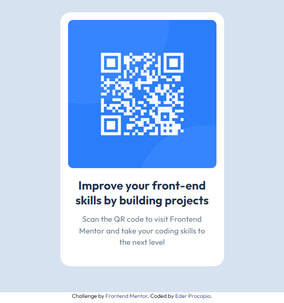

# Frontend Mentor - QR code component

## Olá! 👋

Essa é a resolução de um desafio proposto pelo site <a href="https://www.frontendmentor.io/home" target="_blank">Frontend Mentor</a>, com o objetivo de testar minhas habilidades em desenvolvimento front-end. Pretendo compartilhar uma série de desafios à medida que avanço, e este é o primeiro.

## Sobre o Frontend Mentor:

O Frontend Mentor é uma plataforma que oferece desafios de desenvolvimento front-end para ajudar programadores a aprimorar suas habilidades. A plataforma é voltada tanto para iniciantes quanto para desenvolvedores experientes. O site disponibiliza projetos práticos de diversos níveis de dificuldade, permitindo que os usuários pratiquem a construção de layouts responsivos, implementem funcionalidades interativas e aperfeiçoem suas habilidades em HTML, CSS e JavaScript. 
Os desafios geralmente incluem um design de interface pré-definido (em formatos como Figma ou imagens), e cabe ao desenvolvedor escrever o código para trazer esse design à vida. Além disso, os participantes podem compartilhar suas soluções e receber feedback da comunidade, tornando o processo de aprendizado mais colaborativo. 
É uma excelente forma de desenvolver habilidades práticas e construir um portfólio, especialmente para aqueles que buscam experiência real em desenvolvimento front-end.

## Sobre o desafio

Neste desafio, foi proposta a criação de um cartão com QR Code simples, utilizando apenas HTML e CSS. A plataforma fornece informações relevantes para a conclusão do desafio, como fontes, paleta de cores, imagens utilizadas no projeto e um arquivo JPG com o layout sugerido.
Aqui está a prévia do layout final do desafio:    

  

## Solução

Na resolução desse desafio foi usado HTML5 e CSS. Para estilizar o projeto, foi utilizado display flex que é justamente o que estou aprendendo na atualidade. 
Fiz o upload da minha versão do projeto para o Github Pages e pode ser visto no link abaixo:

  

